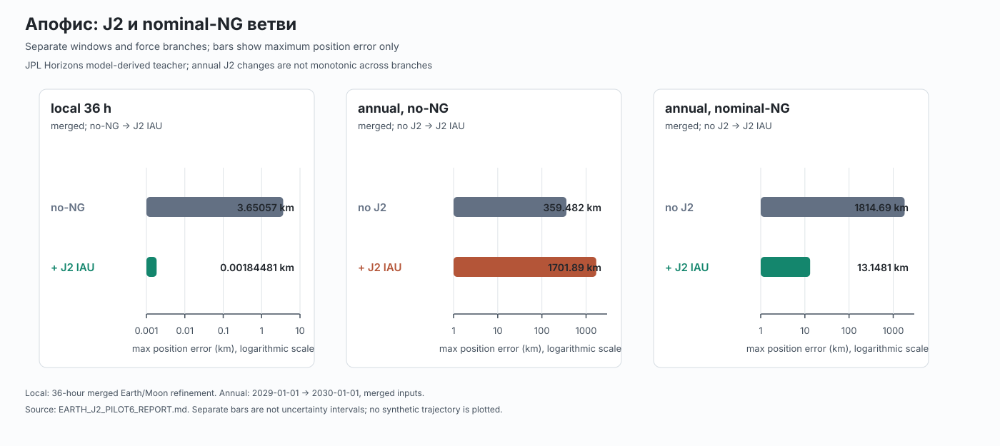

# Поиск ошибки, исходя из физики

Этот документ сохраняет историю адресных проверок после того, как базовая
модель дала большие расхождения с reference-эфемеридой. Формат каждой проверки
одинаков: **ошибка → гипотеза → проверка → результат → ограничение**. Здесь
смешаны несколько инженерных аудитов, но не смешиваются их объекты, окна,
ветви с негравитационным параметром (NG) и численные методы.

Все сравнения используют сохранённые эфемериды JPL Horizons как model-derived
teacher. Это диагностика распространения и согласования моделей, а не открытие
новой физики и не независимые наблюдательные данные. Исходная development30
оценка и её selector frozen; описанные адресные изменения были выбраны после
просмотра результатов и потому имеют статус **post-hoc audit**, а не новой
validation. Сырые файлы и полные traces остаются в ignored data/output
каталогах; в GitHub предназначены этот текст, standalone-визуализация и
компактные статические SVG-панели.

Продолжение истории: [ограничения на 100 новых телах](SELECTOR_CONFIRMATION100_DIAGNOSTICS.md)
разделяет недостаточность сил, ошибку выбора и неудачный fallback.
[Галерея реальных траекторий](TRAJECTORY_SHOWCASE.md) сохраняет 19 GIF:
движущееся тело рисует прогноз и Horizons, расхождение показано отдельно
с подписанным увеличением. Прежние Earth J2/NG/SVG, интерактивная физическая
диагностика и реконструкция формы Апофиса ниже сохраняют свои источники.

## Апофис: начальные возмущения и усиление через встречу, 2026-09-09

**Вопрос:** почему небольшой residual до встречи может сильно вырасти после
неё? **Проверка:** 24 signed initial-state probes в неизменённой all-direct
модели; ±1/10 m положения и ±1e-6/1e-5 m/s скорости по трём осям ICRF.
**Результат:** начальный 1 m даёт 3.15–11.74 km годового сдвига;
1 микрометр/с — 18.98–55.25 km. Две амплитуды согласуют производные
лучше 0.0015% на заданных датах. **Ограничение:** показана чувствительность
модели, а не источник всего остатка или covariance реальной орбиты.
Точность входов нужна в общем режиме сильных встреч; ID астероида
не должен выбирать особую силу. [Все оси и рост по времени](APOPHIS_INITIAL_SENSITIVITY_REPORT.md).

## Апофис: межузловая интерполяция и реализация сил, 2026-09-09

**Ошибка:** прямой барицентрический Sun-only PPN оставлял 2.351 km.
**Гипотезы:** потеря точности планет между сохранёнными узлами или ошибка
реализации общей силы. **Проверка:** native DE441 Type 2, шесть вариантов
эфемерид × два DP settings и RK4; отдельно Decimal50 реализация всех членов.
**Результат:** узлы совпадают до 2.5 mm, внутри прежних суточных интервалов
Moon и Mercury различаются на километры. Общая замена эфемерид всех главных
источников сдвигает годовую траекторию на 209.302 m, остаток стал 2.551 km.
Force gate 1e-17 AU/day² пройден. **Ограничение:** источник остатка ещё
не установлен; direct backend не закрывает годовой 1 km и cross-solver
1 m критерии. Это teacher matching, не новая оценка selector.
[Полный отчёт](APOPHIS_SPK_AUDIT_REPORT.md).

## Апофис: PPN и движение начала координат, 2026-09-09

**Ошибка:** fixed-pole Schwarzschild оставлял 7.292 km в годовом окне.
**Гипотезы:** изолированной solar GR недостаточно; вычитание модельного
ускорения Солнца не вполне согласовано с заданной внешней эфемеридой.
**Проверка:** 18 PPN records и 12 direct-barycentric records, два алгоритма,
неизменные initial/teacher, отдельные контракты, все ветви сохранены.

**Результат:** прямой Sun-only outer PPN даёт 2.351 km; добавление Solar J2
увеличивает до 3.062 km. В heliocentric серии лучший scalar error 2.300 km,
но это не подтверждение приближённого ускорения начала. Full all-major PPN
ухудшает teacher agreement. Pluto даёт 343 m сдвига, смена постановки —
842 m. Оба эффекта подтверждены DP и RK4; чужие субметровые оценки Pluto
не переносятся на этот сильный пролёт.

**Ограничение:** ни годовой 1 km budget, ни <=1 m cross-solver gate
не пройдены. До пролёта direct Sun-only ошибка 0.551 m на 102-й день,
после резко растёт; единственная причина не установлена. Дальше нужны
согласованный independent backend и sensitivity, без target-ID routing.
[Полный отчёт с ростом ошибок и provenance](APOPHIS_EIH_REPORT.md).

## Апофис: соглашения модели, 2026-09-09

Восемь сохранённых Horizons headers объявляют Earth J2 only. Поэтому
прежнее улучшение после J3/J4 нельзя считать восстановлением отсутствующих
в teacher гармоник: возможно компенсирующее действие. Этот вывод уточняет
интерпретацию, сохраняя исходные результаты.

Отдельные fixed Earth pole и solar J2 проверки дали 7.292 и 15.607 km
вместо baseline 10.464 km; совместно 12.423 km. Новая матрица: 9 новых
прогонов + 3 reused baseline, два алгоритма. Effects согласуются до
миллиметров, absolute cross-solver разница 1.235–1.242 m. Остаток 1 km
не закрыт. [Полная проверка, таблица роста ошибки и следующие гипотезы](APOPHIS_GRAVITY_CONVENTIONS_REPORT.md).

## 153814 (2001 WN5): гипотеза об асферичности Земли

### Ошибка

В годовом окне 2028-05-27—2029-05-27 базовая модель с точечной Землёй дала
максимальную position error **13.452789 km** на reference daily + refined
сетке. Объект прошёл на 248,711 km от Земли 2028-06-26; другие близкие тела не
давали сопоставимого локального объяснения. В исходной карте development30
это был один из пяти случаев без кандидата для допуска 1 km.

### Гипотеза и проверка

Точечная масса пропускает ведущую поправку от несферичного поля Земли. В
варианте EarthJ2 добавлены direct и indirect члены с `J2=0.00108262545`,
радиусом `6378.1366 km` и приближённым IAU mean pole. Параметры не подгонялись
по остаткам 153814. В качестве отрицательного контроля проверено добавление
Pluto system barycentre (`GM=975.5 km³/s²`) поверх baseline.

| Вариант | Годовой максимум | Production → fine |
| --- | ---: | ---: |
| baseline | 13.452789212 km | 0.839 m |
| EarthJ2 | 0.029853293 km (29.853 m) | 0.830 m |
| Pluto | 13.452786048 km | 0.864 m |
| EarthJ2 + Pluto | 0.029805448 km | 0.809 m |

Проверка закрыла исходные 90/180/365-дневные окна: для годового окна
EarthJ2 оставил 29.853 m, а production/fine shift — 0.830 m.

Статическая панель: 153814 и Earth J2

### Результат и ограничение

Согласованное уменьшение остатка поддерживает гипотезу, что земная
облатность была существенной пропущенной силой именно в этом пролёте. Оно не
доказывает, что все оставшиеся 29.853 m вызваны одним J2, и не превращает
post-hoc вариант в новый operational selector. Pluto сдвигает траекторию
только на 0.212 m в production и 0.224 m на fine; он не объясняет километровый
остаток. Для субметрового вывода потребуются более строгая ориентация Земли,
проверка интерполяции и независимый численный контроль.

## 613569 (2006 TU7): гипотеза о номинальном NG

### Ошибка

В окне 2028-01-04—2029-01-03 baseline дал **12.089237225 km** годовой
position error. Ближайшая планета — Венера (2,498,461 km, 2028-02-03), поэтому
геометрия не указывала на сильный земной пролёт; в исходной карте это были
ещё два no-candidate окна.

### Гипотеза и проверка

В immutable Horizons header уже был номинальный поперечный коэффициент
`A2=1.18779071272e-13 AU/day²`, при `A1=A3=0`. В аудит добавлено ровно это
сохранённое значение без fit по этому rollout. Это отдельная teacher-matching
ветвь nominal-NG, а не часть прежней четырёхмодельной карты.

| Вариант | Годовой максимум | Production → fine |
| --- | ---: | ---: |
| baseline | 12.089237225 km | 1.697 m |
| nominalNG | 0.013500432 km (13.500 m) | 1.874 m |
| Pluto | 12.088471415 km | 1.753 m |
| nominalNG + Pluto | 0.012772522 km | 1.885 m |

### Результат и ограничение

Nominal NG снижает годовой остаток до 13.5 m и закрывает 180/365-дневные
окна; это согласуется с накопительным поперечным воздействием, которое было
исключено из исходной карты. Но один сохранённый fitted coefficient не
устанавливает механизм: возможны Yarkovsky и другие эффекты. Доступность NG
и его неопределённость не были operationalно проверены в этом post-hoc
аудите; последующий v2-контракт ввёл явный признак доступности, но sigma
коэффициента по-прежнему не установлена. То, что коэффициент взят из teacher
header, не делает его независимым предсказанием. Pluto снова даёт лишь
субметровый сдвиг (0.857 m production, 0.914 m fine).

## Апофис: локальное улучшение J2 и годовой стресс-тест

Апофис — отдельный объект и не является одним из outlier-результатов выше.
В годовом окне 2029 года его reference-сетка имеет 797 узлов и локальное
36-часовое окно с 5-минутным refinement. На sampled grid центр Земли достигает
минимума 38,014.448 km в 2029-04-13 21:45 TDB; direct Earth acceleration в
этой точке в 46.789 раза больше direct solar acceleration, а скорость
относительно Земли — 7.422 km/s. Лунный sampled минимум (112,351.093 km)
приходится ровно на конец refinement и потому не является непрерывным
closest-approach измерением.

### Локальное окно: ошибка → гипотеза → проверка

До J2 merged no-NG branch имела 3.65057 km максимальной ошибки. С Earth J2
и IAU mean pole она дала 0.00184481 km (1.845 m), endpoint 0.000768364 km;
с nominal NG — 0.00179122 km и 0.000722285 km. Это сильная локальная
поддержка гипотезы о значимости J2 при земном пролёте. Однако coarse/fine
RK4 разность составляет около 1.136 m, а смена fixed J2000 pole на IAU —
9.270 m. Поэтому локальный результат не означает доказанную субметровую
точность и не заменяет независимую проверку ориентации и интегратора.

### Годовое окно: почему тот же force change ведёт себя иначе

На старте 2029-01-01 накопленная ошибка взаимодействует с локальным событием:

| Ветка, merged inputs | Без J2 | С J2 IAU |
| --- | ---: | ---: |
| no-NG | 359.482 km | 1701.89 km |
| nominal-NG | 1814.69 km | 13.1481 km |

В no-NG годовая ошибка после добавления J2 выросла, а в nominal-NG ветке
уменьшилась. Это пример частичной компенсации пропущенных эффектов: близость
к teacher для конкретного годового rollout не равна физической полноте модели.
В годовом J2 сравнении уменьшение RK4 шага дало около 1.998 km, а добавление
локальных Earth/Moon узлов изменило endpoint примерно на 56.8 km. Эти числа —
чувствительность между постановками, не строгие bounds.

Статическая панель: Апофис, локальное и годовое окна

## Численная проверка не заменяет физическую

Независимый Dormand–Prince 5(4) был применён с тем же callback ускорения, что
и старый RK4. Поэтому он независим как алгоритм интегрирования, но не как
реализация физической модели. Для старых merged inputs годовые максимумы такие:

| Метод | Max position error |
| --- | ---: |
| RK4, scale 0.5 | 13.148071 km |
| RK4, scale 0.25 | 11.1509 km |
| RK4, scale 0.125 | 12.9777 km |
| DP, relative tolerance 1e-10 | 12.005854 km |
| DP, relative tolerance 1e-12 | 11.746851 km |
| DP, relative tolerance 1e-13 | 11.958729 km |

Старый baseline `13.14807051432607 km` и RK4 half-step shift
`1.9977699372970446 km` воспроизведены. Не монотонный ряд DP, различия в
сотни метров и hourly-input сдвиг `0.277863 km` не дают сходимости к метрам,
численной границы или основания объявить задачу закрытой. Локальные DP
ошибки порядка 1.15–1.20 m в 36-часовом окне нельзя переносить на старт за
несколько месяцев.

Профиль годовой ошибки показывает, где искать следующую причину, но не
называет её:

| Узел TDB | Position error |
| --- | ---: |
| 2029-04-01 | 1.939 m |
| 2029-04-13 21:45, Earth sampled minimum | 1.857 m |
| 2029-05-01 | 222.405 m |
| 2029-07-01 | 1.521 km |
| 2030-01-01 | 12.006 km |

После пролёта остаются неразделёнными численная ошибка, представление и
интерполяция ephemerides, а также physical mismatch. См. [интерпретацию
solver audit](APOPHIS_SOLVER_AUDIT_INTERPRETATION.md) и [географический
аудит](APOPHIS_GEOGRAPHY_REPORT.md); результаты solver не являются новой
validation выборки.

## Визуальная история и происхождение данных

Интерактивная карта [Апофис: орбита и пролёт 2029 года](figures/physics_diagnostics/apophis-trajectory.html)
сохраняет фактические данные из уже построенного визуального артефакта:
солнечный режим и режим Earth/Moon encounter, 3D states в TDB и подписи
происхождения Horizons. Проекция ICRF → mean ecliptic J2000 используется
только для отображения; численные расстояния и ошибки считались в исходных
3D координатах. Карта не выполняет новую propagation и не добавляет
синтетических траекторий.

Для просмотра без браузерного интерактива сохранены [панель 153814 / Earth
J2](figures/physics_diagnostics/153814-earthj2.svg) и [панель Апофиса
J2/NG](figures/physics_diagnostics/apophis-j2-ng.svg). Их исходная таблица
находится в [plot_data.json](figures/physics_diagnostics/plot_data.json), а
воспроизводящий генератор — в
[make_physics_diagnostics_svg.py](figures/physics_diagnostics/make_physics_diagnostics_svg.py).
SVG используют только shapes и text, без внешних ресурсов; step sensitivity
подписана отдельным текстом и не нарисована как error bar.

Основные численные источники и воспроизводимые аудиты:

- [Earth J2 pilot6](EARTH_J2_PILOT6_REPORT.md) — локальное/годовое сравнение
  no-NG и nominal-NG, interpolation и pole sensitivity.
- [Development30 outlier audit](DEVELOPMENT30_OUTLIER_AUDIT_REPORT.md) —
  адресные проверки 153814 и 613569, включая Pluto control.
- [Apophis geography](APOPHIS_GEOGRAPHY_REPORT.md) — геометрия и профиль
  накопления ошибки без propagation при повторном анализе.
- [Apophis solver audit](APOPHIS_SOLVER_AUDIT_INTERPRETATION.md) — DP/RK4 и
  ограничения численной интерпретации.

Команды воспроизведения указаны в этих отчётах и запускаются offline через
`uv` с system Python 3.14.7. Повторный запуск завершённых production-аудитов
может изменить timestamps и нарушить frozen provenance, поэтому для них
следует использовать предусмотренные verifier-команды или новый namespace.
Raw Horizons files и full accepted traces не копируются в этот документ.

## Продолжение: подробное окно Луны и проверка Венеры

[Новый аудит](APOPHIS_MOON_VENUS_REPORT.md) завершён: лунный минимум находится
14 апреля 2029 около 14:32 TDB, примерно в 95 969 km от центра Луны — за
границей прежнего 36-hour refinement. Подробные Earth/Moon inputs дают
годовое улучшение около 1.5 km, но остаток около 10 km и RK4 step sensitivity
около 2 km сохраняются. Venus-only refinement не даёт устойчивого выигрыша.
Обнаружена также разница daily/refined teacher; она описана отдельно, без
подмены reference. Историческая карта выше сохранена в исходном окне.

## Продолжение: эталон и численная арифметика

[Следующая проверка](APOPHIS_REFERENCE_TIME_REPORT.md) разделила три вещи:
данные, начало прогноза и арифметику. Старый длинный и новый годовой запросы
Horizons дают расхождение до 17.212 km при одинаковом JPL#220; точный повтор
старого URL воспроизводит все 4018 states. При согласованных initial/teacher
остаток модели почти одинаков: **10.418 и 10.462 km**. Замена только teacher
создала бы видимость улучшения до 6.799 km.

Относительная временная шкала и точные TDB calendar knots улучшили DP:
разница строгих настроек 0.403 m для старого старта и 1.429 m для нового.
RK4 пока не сходится устойчиво, поэтому остаток ещё нельзя целиком
приписать конкретной слабой силе. Этот этап важен для истории физической
диагностики: прежде чем вводить поправку, надо проверить согласованность
данных и численную реализацию. Силы и предыдущие результаты сохранены.

## Продолжение: форма тела и более подробное земное поле

[Аудит формы и Earth J3/J4](APOPHIS_SHAPE_WEAK_FORCE_REPORT.md) добавляет
реальную preliminary PDS mesh Апофиса и сравнение с Eros, Apollo, Phaethon,
Itokawa и Didymos. [Три проекции OBJ](figures/physics_diagnostics/apophis-pds-shape.svg)
сохранены отдельно с масштабом и источником; это реконструкция, не
фотография и не предсказание ориентации в 2029 году.

В 24 новых расчётах Earth J3+J4 уменьшают согласованный годовой остаток
примерно с 10.46 до 8.54 km. Протяжённость самого астероида в трёх
неподвижных ориентациях даёт метровые сдвиги, частично неотделимые от
численной чувствительности. Это разные механизмы: высшие гармоники поля
Земли и распределение массы target. Ни один результат не закрывает
оставшиеся километры и не заменяет проверку spin/thermal physics.

## План будущих анимаций

Пользователь отдельно одобрил изображение PDS mesh Апофиса в трёх
проекциях и попросил использовать такой вид в дальнейшем оформлении
(2026-09-08). Сохранять реальную геометрию, общий масштаб, источник и
статус preliminary model. В будущих сценах траектории отличать показ формы
от физически рассчитанной ориентации: текущая mesh сама по себе не задаёт
attitude evolution во время пролёта.

В конце проекта можно подготовить несколько анимаций, где marker тела движется
по времени и постепенно рисует predicted и reference trajectories: например,
годовой Апофис с отдельной паузой на Earth pass, 153814 с EarthJ2 и 613569 с
nominalNG. Каждая сцена должна явно подписывать объект, вариант force model,
TDB, единицы и источник reference; в панели можно показывать sampled error и
локальное окно, сохраняя оговорку о grid minima.

Сейчас GIF не создаются. Будущая сборка должна читать уже сохранённые
accepted/predicted/reference traces, проверять их hashes и оставаться
визуальным объяснением диагностики, а не новой validation или независимым
численным экспериментом.

## 8–9 сентября: отделение численной ошибки от физической поправки

[Новый численный отчёт](PRECISE_PROPAGATION_REPORT.md) сохраняет ещё один
шаг этой истории. Согласование RK4 h со временем и компенсация накопления
state increments устранили прежнюю километровую нестабильность. Два
алгоритма всё ещё расходятся на 1.24–1.27 m; критерий ≤1 m не пройден.
При этом векторы J3/J4 поправки около 1.9235 km согласованы до
2.12 cm / 1.57 mm для старого/нового initial. Остаток около 8.5 km
относительно teacher этим не объяснён.

[Общая модель](RELATIVE_FORCE_REGRESSION_REPORT.md) проверена на всех
30 inspected development объектах: 132 прогноза, до 62.4 m daily annual
error, до 7.2 cm cross-solver difference на шести controls. Для WN5
дополнительный эффект J3/J4 лишь 0.7708 m. Эти случаи полезно показывать
рядом с Апофисом как зависимость значимости силы от траектории.
Старые анимации/графики не пересчитывались по новым данным молча.
