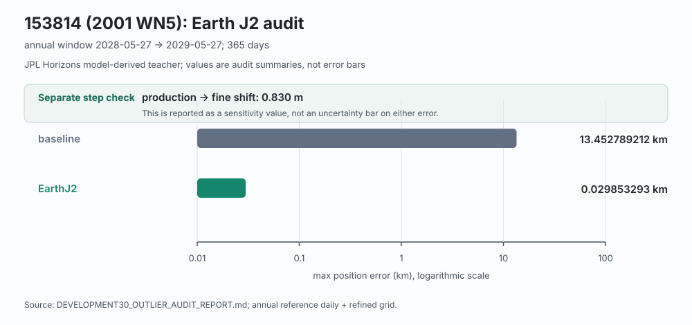
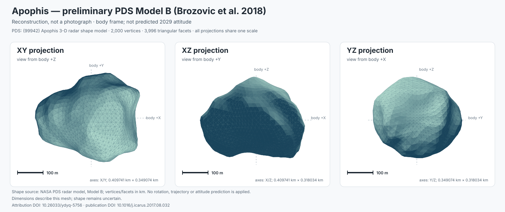

# Три истории о том, почему прогноз ошибается

Из большого журнала экспериментов здесь выбраны три сюжета. В каждом —
наблюдаемая ошибка, проверяемая гипотеза и граница вывода.

[Главная](../README.md) · [Траектории](TRAJECTORY_SHOWCASE.md) · [Полный журнал](PHYSICS_DIAGNOSTICS.md)

## 1. Земля не совсем шар

**Ошибка.** На изученном объекте 153814 годовой прогноз расходился с Horizons
примерно на 13,45 км.

**Гипотеза.** Возле Земли может быть важна несферичность её гравитационного поля.
В модели она представлена Earth J2.

**Проверка.** Адресная ablation с добавлением этой физической поправки.

**Результат.** Расхождение уменьшилось до **29,85 м**. На другом изученном теле,
613569, существенным оказался доступный номинальный негравитационный A2:
около **12,09 км → 13,50 м**.

Эти результаты относятся к post-hoc диагностике development-тел. Поправки
вошли в общий набор сил через физические параметры, без выбора по номеру
астероида; новый selector затем проверялся отдельно.

[Полный разбор двух тел](DEVELOPMENT30_OUTLIER_AUDIT_REPORT.md).

## 2. Что происходит с Апофисом

Во время сильного пролёта небольшие различия могут вырасти в большой
последующий сдвиг. Проверки охватили численную схему, согласование начального
состояния и эталона, планетные эфемериды, слабые силы и чувствительность входов.

**Что удалось отделить.** Исправление временной арифметики и накопления
состояния устранило прежнюю километровую нестабильность RK4. Проверка reference
показала, почему нельзя молча смешивать запросы Horizons с разными границами.
Независимый метод помог проверить сохранённый годовой прогноз.

**Что осталось.** У специального diagnostic backend годовое расхождение
**2,552 км**. Перезапуск из точного эталонного состояния перед встречей
не устраняет весь последующий остаток. Его единственная причина не установлена.

Апофис не входит в 100 новых тел и не демонстрирует успех обычного v4 fallback.
Его история показывает границу метода. Ковариация и предупреждения требуют
отдельной проверки, прежде чем говорить о вероятностях реального события.

[Итоговый аудит](APOPHIS_ENCOUNTER_CLOSURE_REPORT.md) ·
[Чувствительность начального состояния](APOPHIS_INITIAL_SENSITIVITY_REPORT.md).

### А если дело в форме?

Это предварительная PDS-реконструкция, **Brozović et al., Model B**,
[DOI: 10.26033/ydyq-5756](https://doi.org/10.26033/ydyq-5756).
Показана одна и та же mesh с общим масштабом; точная реальная форма неизвестна.

Проверено ведущее влияние протяжённости тела в трёх фиксированных ориентациях.
Получились малые сдвиги, часть которых не отделена от численной чувствительности.
Эта проверка не объяснила весь километровый остаток и не моделирует реальное
вращение, деформацию или тепловую эволюцию во время встречи.

[Форма и слабые силы](APOPHIS_SHAPE_WEAK_FORCE_REPORT.md).

## 3. Больше сил не всегда означает меньшую ошибку

Строгий допуск **100 м** выявил два разных отказа на новой выборке.

| Случай | Что произошло | Чему он учит |
| --- | --- | --- |
| 310442 / 2000 CH59 | Полный fallback: **100,969 м**; P+GR: **85,642 м** | Достаточный кандидат есть, но выбран другой |
| 893065 / 2016 CL136 | Лучший кандидат: **130,130 м**; полный: **153,166 м** | При данном допуске недостаточен весь набор |

Здесь увеличена **только разность в 10⁸ раз**. Число `3D error` настоящее.
Окно иллюстрации выбрано после оценки вокруг максимума ошибки на суточной сетке;
эта информация не поступала селектору.

Оба отказа отмечены OOD. Однако сам OOD ещё не надёжный детектор недостаточности:
на основном допуске 1 км все 154 предупреждённых запроса фактически успешны.
У hybrid при 100 м специальный no-candidate flag дал один true positive и
28 false positives.

[Все отказы и их интерпретация](SELECTOR_CONFIRMATION100_DIAGNOSTICS.md).

---

Следующий уровень подробности — [полный журнал физической диагностики](PHYSICS_DIAGNOSTICS.md).
Он сохраняет ранние результаты с их исходными моделями и временными окнами.
