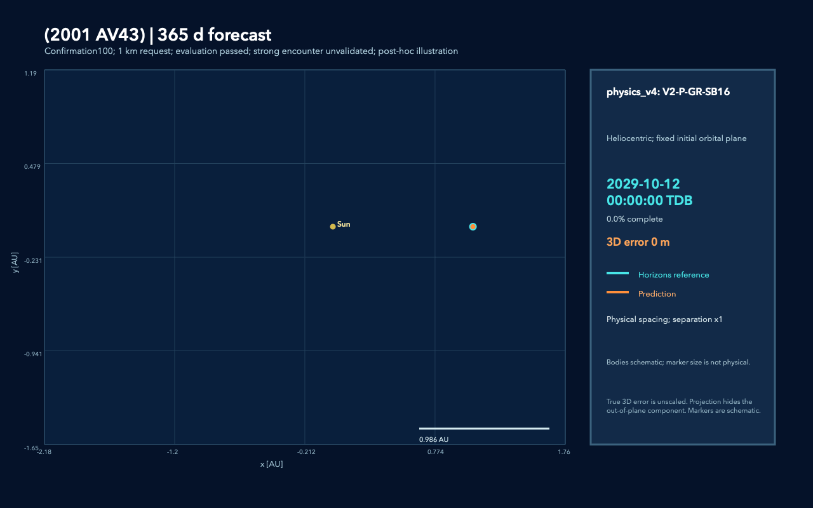

# История исследовательских этапов

Снимок прежней главной страницы от 10 сентября 2026. Числа и статусы ниже относятся к своим этапам; актуальный результат — [confirmation100](SELECTOR_CONFIRMATION100_REPORT.md).

# Adaptive physics–ML propagation of small-body orbits

Локальный исследовательский проект по небесной механике, прогнозированию
траекторий малых тел и scientific machine learning.

<!-- confirmation100-readme:start -->
**10 сентября: завершена независимая проверка на 100 новых телах.**
Замороженный v4 проверен в 500 вложенных окнах от 7 до 365 суток:
девять страт, встречи с Землёй/Венерой/Марсом/Юпитером, поясные контроли,
NG и малые перигелии. Все 100 тел проходят каждый горизонт при 1 km
у обоих v4. Метод не переобучался по новым траекториям.

| Метод | Успешные окна при 1 km | Максимальная ошибка | Время на заранее выбранных 24 телах |
| --- | ---: | ---: | ---: |
| Физическое правило v4 | 500/500 | 806.438 m | 413.839 s |
| Гибрид v4 с CART | 500/500 | 522.314 m | 418.163 s |
| Постоянный полный кандидат | 500/500 | 153.166 m | 592.082 s |
| Прежний CART v3 | 499/500 | 1265.050 m | 421.726 s |

Физическое правило экономит **30.10%** полного online времени; добавочная
ML-поправка не улучшает число успешных окон и на 1.04% медленнее правила.
Timing — сумма 120 медиан трёх повторов, только на общих 24 телах.
При строгом 100 m допуске v4/full проходят 498/500: один недостаточный
набор кандидатов и один неудачный fallback, оба с предупреждением v4.
154/500 запросов при 1 km имеют OOD warning, хотя фактически достаточны.
Это условное распространение относительно Horizons, а не гарантия
реальной точности для любого тела. Известный годовой остаток Апофиса
**2.552 km** остаётся отдельным ограничением.

[Проверенный отчёт](SELECTOR_CONFIRMATION100_REPORT.md) ·
[Состав выборки](SELECTOR_CONFIRMATION100_SAMPLE_AUDIT.md) ·
[Контракт](SELECTOR_CONFIRMATION100_CONTRACT.md) ·
[Физический разбор](SELECTOR_CONFIRMATION100_DIAGNOSTICS.md).
Проверены 1170832 error samples, 800 traces, 684 raw paths и прямой timing;
325 tests прошли. [Ответ на физический вопрос](RESEARCH_CONCLUSIONS.md).

[Галерея: 19 анимаций шести тел](TRAJECTORY_SHOWCASE.md) показывает
растущие прогнозную и эталонную траектории, отдельные крупные планы и
границы точности. Overview использует настоящий масштаб; на zoom
коэффициент увеличения только разности явно подписан.



Прежние результаты ниже сохраняют свои исходные выборки и статус.
<!-- confirmation100-readme:end -->

## Главная цель

Определить, какие физические модели достаточны для заданного горизонта и
точности, и проверить алгоритм выбора самой дешёвой достаточной модели по
информации, доступной в начале прогноза. В первой версии одна модель выбирается
на весь recursive rollout; качество выбора оценивается по ошибкам будущей
траектории и стоимости вычислений. Сначала проверяются простые физические
правила, затем — добавочная польза небольшого ML-селектора. Переключение
внутри траектории и residual correction остаются расширениями.

Основной результат — trajectory forecast и параметры closest approach на
полностью отложенных объектах и будущих временных интервалах. Восстановление
закона центрального притяжения остаётся первым sanity check, но не является
единственной целью проекта.

## Путеводитель

- [Что сохранить и показать на GitHub](GITHUB_PRESENTATION_GUIDE.md)
  — пожелания к оформлению pet project: история поиска ошибки через физику,
  форма Апофиса, растущие траектории и отдельные крупные планы расхождения.
- [Селектор v4: физическое правило и ML на ещё 24 новых телах](SELECTOR_V4_HOLDOUT24_REPORT.md)
  — все четыре метода проходят 120/120 окон при 0.1/1/10 km. При 1 km
  физическое правило: 327.140 s, hybrid ML: 349.444 s, full: 487.860 s;
  правило экономит 32.94% времени к full, ML медленнее правила на 6.82%.
  [API, предупреждения и команды](SELECTOR_V4_USAGE.md). Цикл завершён
  10 сентября; 304 tests и полный аудит прошли. Сильные встречи остаются
  за пределами этой проверки, остаток Апофиса 2.552 km не изменился.
- [Селектор v3: результаты на 24 новых телах](SELECTOR_HOLDOUT24_REPORT.md)
  — при 1 km CART 119/120, простое правило 118/120, full 120/120;
  полные замеры времени и разбор промаха на поясном 3418.
- [Апофис: локализация остатка и границы точности](APOPHIS_ENCOUNTER_CLOSURE_REPORT.md)
  — восемь новых расчётов; годовой остаток 2.552 km сохраняется даже при
  независимой численной проверке, локальный перезапуск не устраняет проблему.
- [Обучаемый селектор v3: API и предупреждения](SELECTOR_V3_USAGE.md)
  — четыре CART-модели достаточности и отдельная проверка на новых телах.
- [Апофис: совместная ковариация орбиты и A1/A2](APOPHIS_COVARIANCE_REPORT.md)
  — 34 расчёта: формальная большая σ растёт с 1.57 до 4729 km за 2029 год;
  linear/cubature согласуются, но девятилетний numerical gate не пройден.
- [Апофис: чувствительность начального состояния](APOPHIS_INITIAL_SENSITIVITY_REPORT.md)
  — 24 прогона: начальный сдвиг на 1 m даёт 3.15–11.74 km через год;
  общий режим сильных встреч требует проверки точности входов.
- [Апофис: native DE441 и независимая проверка сил](APOPHIS_SPK_AUDIT_REPORT.md)
  — 18 записей: межузловая интерполяция меняет годовую траекторию на 209 m,
  но остаток 2.55 km сохраняется; Decimal50 force gate пройден.
- [Апофис: PPN и барицентрическая система](APOPHIS_EIH_REPORT.md)
  — 27 новых прогонов + 3 reused: прямой Sun-only PPN даёт 2.351 km;
  frame shift около 842 m, Pluto около 343 m. Бюджет 1 km остаётся открытым.
- [Апофис: соглашения гравитационной модели](APOPHIS_GRAVITY_CONVENTIONS_REPORT.md)
  — fixed Earth pole снижает annual mismatch 10.46 → 7.29 km;
  solar J2 повышает до 15.61 km. Saved teacher содержит Earth J2 only.
- [Общая модель J2/J3/J4 на 30 объектах](RELATIVE_FORCE_REGRESSION_REPORT.md)
  — 132 прогноза, max daily annual error 62.4 m;
  [API и пример вызова](RELATIVE_FORCE_USAGE.md).
- [Апофис: численная устойчивость](PRECISE_PROPAGATION_REPORT.md)
  — исправлена километровая нестабильность RK4; межметодный остаток 1.24–1.27 m.
- [Апофис: форма тела и Earth J3/J4](APOPHIS_SHAPE_WEAK_FORCE_REPORT.md)
  — реальная PDS mesh, сравнение с другими телами и 24 расчёта:
  J3+J4 уменьшают годовой остаток до 8.54 km; прямая shape поправка мала.
- [Апофис: эталон и временная арифметика](APOPHIS_REFERENCE_TIME_REPORT.md)
  — 18 расчётов: reference расходится на 17.2 km, согласованный остаток
  остаётся 10.4 km; DP стал устойчивее, RK4 ещё требует проверки.
- [Поиск ошибки, исходя из физики](PHYSICS_DIAGNOSTICS.md)
  — сохранённая история Earth J2/NG, графики и интерактивная карта Апофиса.
- [Проверка Луны и Венеры для Апофиса](APOPHIS_MOON_VENUS_REPORT.md)
  — 22 расчёта: лунное сближение уточнено, годовой остаток около 10 km остаётся.
- [docs/FRESH_HOLDOUT12_REPORT.md](FRESH_HOLDOUT12_REPORT.md)
  — frozen v2 на 12 новых объектах: точность, 360 прямых timing вызовов и ограничения.
- [docs/FRESH_HOLDOUT12_REPRODUCIBILITY.md](FRESH_HOLDOUT12_REPRODUCIBILITY.md)
  — команды, freeze, raw inputs и проверка завершённых результатов.
- [docs/APOPHIS_SOLVER_AUDIT_INTERPRETATION.md](APOPHIS_SOLVER_AUDIT_INTERPRETATION.md)
  — независимый DP5(4): годовое расхождение около 12 km остаётся, численная сходимость открыта.
- [docs/FORCE_MODELS_V2_REPORT.md](FORCE_MODELS_V2_REPORT.md)
  — интеграция J2/NG: все 150 окон у полной модели ≤100 m; selector replay и стоимость.
- [docs/FORCE_MODELS_V2_USAGE.md](FORCE_MODELS_V2_USAGE.md)
  — отдельный прогноз из initial state, общий сборщик физических сил и API v2.
- [docs/FORCE_MODELS_V2_CONTRACT.md](FORCE_MODELS_V2_CONTRACT.md)
  — J2, NG availability/uncertainty, новая матрица и условия replay.
- [docs/DEVELOPMENT30_OUTLIER_AUDIT_REPORT.md](DEVELOPMENT30_OUTLIER_AUDIT_REPORT.md)
  — география двух проблемных объектов: Earth J2 и A2 закрывают пять окон,
  влияние Плутона проверено отдельно.
- [docs/DEVELOPMENT30_REPORT.md](DEVELOPMENT30_REPORT.md)
  — выбор модели на 30 новых объектах: точность, отказы и полная стоимость.
- [docs/DEVELOPMENT30_CONTRACT.md](DEVELOPMENT30_CONTRACT.md)
  — замороженные выборка, object split, модели, признаки и правила.
- [docs/DEVELOPMENT30_REPRODUCIBILITY.md](DEVELOPMENT30_REPRODUCIBILITY.md)
  — команды и восстановление незавершённого расчёта.
- [docs/ENCOUNTER_PLANETS_PILOT6_REPORT.md](ENCOUNTER_PLANETS_PILOT6_REPORT.md)
  — влияние планет и сохранения мелких шагов на прогноз сближений.
- [docs/ENCOUNTER_PLANETS_CONTRACT.md](ENCOUNTER_PLANETS_CONTRACT.md)
  — отдельная B2/B3 ablation, одинаковые случаи и численная проверка.
- [docs/ENCOUNTER_SCREENING_PILOT6_REPORT.md](ENCOUNTER_SCREENING_PILOT6_REPORT.md)
  — исходный предварительный B2 forecast: сближения, пропуски и стоимость.
- [docs/ENCOUNTER_SCREENING_CONTRACT.md](ENCOUNTER_SCREENING_CONTRACT.md)
  — forecast-time inputs, независимая оценка и сравнение временных сеток.

- `AGENTS.md` (локальный рабочий контекст) — компактный контекст и правила для будущих Codex-задач.
- [docs/PROJECT_GUIDE.md](PROJECT_GUIDE.md) — подробная карта проекта.
- [docs/RESEARCH_PLAN.md](RESEARCH_PLAN.md) — гипотезы, модели, этапы и
  критерии результата.
- [docs/NEXT_STEPS_MODEL_SELECTION_2026-09-04.md](NEXT_STEPS_MODEL_SELECTION_2026-09-04.md)
  — аудит текущего состояния и уточнённый план выбора минимально достаточной модели.
- [docs/MODEL_SELECTION_PILOT_CONTRACT.md](MODEL_SELECTION_PILOT_CONTRACT.md)
  — контракт первой карты: сетка, допуски, numerical eligibility и runtime.
- [docs/MODEL_SUFFICIENCY_PILOT6_REPORT.md](MODEL_SUFFICIENCY_PILOT6_REPORT.md)
  — максимальные ошибки на траектории, стоимость и offline oracle.
- [docs/EARTH_J2_PILOT6_REPORT.md](EARTH_J2_PILOT6_REPORT.md)
  — отдельная проверка Earth J2, ориентации оси и интерполяции Apophis encounter.
- [docs/NUMERICAL_AUDIT_PILOT6_REPORT.md](NUMERICAL_AUDIT_PILOT6_REPORT.md)
  — сравнение шагов B2 на 24 стартовых окнах.
- [docs/DATA_GUIDE.md](DATA_GUIDE.md) — источники, таблицы, единицы,
  признаки и правила подготовки данных.
- [docs/DECISIONS.md](DECISIONS.md) — принятые решения и их причины.
- [docs/SOURCES.md](SOURCES.md) — официальные источники и требования к
  attribution.
- [docs/EDA_REPORT.md](EDA_REPORT.md) — воспроизводимый технический EDA
  исходного пятиобъектного pilot.
- [docs/EDA_REPORT_PILOT6.md](EDA_REPORT_PILOT6.md) — актуальный EDA
  сбалансированного шестиобъектного engineering pilot.
- [docs/BASELINE_PILOT6_REPORT.md](BASELINE_PILOT6_REPORT.md) —
  восстановление центрального закона и сравнение B0/B1/B2.
- [docs/NBODY_PILOT6_REPORT.md](NBODY_PILOT6_REPORT.md) — restricted N-body
  baseline B3 и уточнённое событие Apophis–Earth 2029.
- [docs/B3PLUS_PILOT6_REPORT.md](B3PLUS_PILOT6_REPORT.md) — ablation малых
  сил: solar GR, 16 массивных астероидов и nominal A1/A2.
- [docs/INITIAL_PROJECT_PLAN_2026-09-01.md](INITIAL_PROJECT_PLAN_2026-09-01.md)
  — исходная историческая версия плана.

## Исследовательский поток

```text
initial state + planetary ephemerides + available physical parameters + horizon + tolerance
                              |
                              v
           forecast-time features / cheap preliminary rollout
                              |
                              v
                    choice of force model
                              |
                              v
                       recursive rollout
                              |
                              v
               future trajectory + closest approach
```

Пересечение геометрических орбит само по себе не считается близким
сближением. Важны одновременное минимальное расстояние, относительная скорость,
отношение планетного ускорения к солнечному и расстояние в Hill radii.

## История этапов до confirmation100

**9 сентября: завершены диагностика Апофиса и свежая проверка селектора v3.**
Для отдельного подробного Apophis backend годовой остаток относительно
Horizons остаётся **2.552 km**; точность 1 km не достигнута. Независимый
интегратор и локальный restart уточнили границы задачи; строгая метровая
сходимость длинного переноса covariance остаётся открытой.
[Отчёт Апофиса](APOPHIS_ENCOUNTER_CLOSURE_REPORT.md).

Обучены четыре CART-регрессора; метод заморожен до выбора 24 новых тел.
На их 120 зависимых окнах при 1 km: **CART 119/120, правило по горизонту
118/120, full 120/120**. Полная модель даёт максимум 67.825 m. Промах
CART — 3418 на 90 сутках: 1.695 km вместо 0.351 m у full; предупреждения
нет. Это ошибка выбора, доступной физики достаточно. Сумма медиан трёх
прямых повторов: CART **349.525 s**, правило **339.071 s**, full **481.900 s**.
CART экономит 27.47% к full, но требует на 3.08% больше времени, чем правило,
при разном числе успешных окон. No-candidate и экстремальные встречи здесь
не валидированы. [Полный отчёт](SELECTOR_HOLDOUT24_REPORT.md).

277 tests прошли; независимо пересчитаны 322144 error samples, проверены
192 traces, 64 event records, 480 timing medians и все 251 raw paths.
Расчёты завершены. Следующий согласованный шаг — обсуждение визуального
оформления; изменения метода требуют новой версии и нового holdout.

**Ранее 9 сентября: проверены native DE441 и реализация сил Апофиса.**
Планетные координаты вычисляются прямо из коэффициентов; прежние узлы
согласуются с ними до 2.5 mm. Более точные входы дают annual mismatch
2.55 km; причина всего остатка не установлена. Независимая Decimal50
реализация сил проходит заданный gate. DP/RK4 различаются на 1.21–1.24 m,
поэтому метровый численный критерий всё ещё открыт.
[Результаты и воспроизведение](APOPHIS_SPK_AUDIT_REPORT.md).

**Следующая серия из 24 проверок чувствительности также завершена.**
Для начального положения получено усиление в 3151–11743 раза; изменение
скорости на 1 микрометр в секунду даёт 19–55 km годового сдвига.
Две амплитуды подтверждают локальную оценку; это не измеренная covariance
и не устранение остатка. [Отчёт](APOPHIS_INITIAL_SENSITIVITY_REPORT.md).
218 tests и оба offline audits проходят. Selector scores сохранены.

**8–9 сентября: общая относительная модель проверена на development30.**
132 годовых прогноза; обе ветви с/без Earth J3/J4 проходят 100 m на
суточной сетке всех 30 изученных объектов, максимум 62.4 m. На шести
контрольных телах DP/RK4 расходятся не более чем на 7.2 cm. Это regression,
без нового selector score. [Результаты](RELATIVE_FORCE_REGRESSION_REPORT.md).

Отдельные 36 численных проверок Апофиса устранили прежнюю километровую
нестабильность RK4; compensated RK4/DP расходятся на 1.24–1.27 m,
поэтому строгий критерий 1 m ещё не пройден. Эффект J3/J4 около 1.9235 km
подтверждён обоими алгоритмами; на этом прежнем этапе teacher mismatch
оставался около 8.5 km (более поздние аудиты описаны выше).
[Численный отчёт](PRECISE_PROPAGATION_REPORT.md). 181 тест проходит.

**Свежая проверка v2 завершена 2026-09-08:** на 12 ранее не использованных
объектах и 60 окнах полная модель и frozen horizon selector проходят
**60/60 при 0.1/1/10 km** без перенастройки. Наибольшая ошибка full —
58.577 m; у selector при этих допусках — 58.577/207.439/1176.342 m.
При 1 km полный прямой замер дал **186.26 s против 268.26 s**, экономия
**30.57%** при одинаковых 60 успешных окнах. При 100 m/10 km прямой runtime
не измерялся. Это правило по горизонту и допуску, не новый ML selector.
Три новых NG header обработаны общим adapter; параметры не подгонялись.
Это маленький целевой holdout с зависимыми горизонтами; отрицательных
no-candidate случаев здесь нет. [Отчёт](FRESH_HOLDOUT12_REPORT.md).

**Апофис остаётся открытым сложным случаем.** Новый независимый DP5(4)
при старых входах оставляет годовой mismatch порядка 12 km. Последующее
расширение Earth/Moon refinement и уточнение Венеры дают около 10.5 km
в DP, но RK4 step sensitivity остаётся около 2 km. Отдельное уточнение
Венеры не даёт устойчивого улучшения. Численная
сходимость до метров не достигнута; добавлять новую силу на основании этого
остатка пока рано. В отдельном 36-часовом окне с локального старта ошибки
около 1.2 m. Следующее — согласованность daily/refined reference и
относительная временная ось в solver/интерполяции с неизменной физикой.
[Moon/Venus результаты](APOPHIS_MOON_VENUS_REPORT.md).
[Результаты и ограничения](APOPHIS_SOLVER_AUDIT_INTERPRETATION.md).

Прошли 130 tests и artifact checks: 240 records, 180 choices, 96 traces,
161072 пересчитанных error samples и 125 raw SHA/size/Git-ignore. Готовые
matrix/cost проходят resume без изменения SHA и timestamps. Старые v1/v2
результаты сохранены. Uncertainty propagation, предупреждение о недостаточном
наборе сил и добавочная польза ML ещё не проверены. После просмотра fresh12
становится inspected set для последующих изменений метода.

### Предыдущий v2 development replay

**V2 завершена 2026-09-08:** J2 и доступные NG встроены в общий прогноз,
добавлены CLI и новый horizon selector. Полная модель проходит все **150/150**
development окон при 100 m; наибольшая ошибка 62.37 m. На старых 12 validation
объектах селектор даёт **59/60, 60/60, 60/60** при 0.1/1/10 km. При 1 km
прямое время 171.17 s против 244.86 s у постоянной полной модели: экономия
**30.1%** при одинаковых 60 успешных окнах. При 100 m остаётся промах 983,
90 суток: выбранная GR-модель даёт 140 m; полный кандидат достаточен.
Это **post-hoc replay**, не свежая независимая validation. Прошли 113 tests,
проверены 600 records, 240 traces, 402680 error samples и 104 raw-файла.
[Отчёт](FORCE_MODELS_V2_REPORT.md), [запуск](FORCE_MODELS_V2_USAGE.md).
Последующие fresh holdout и independent solver audit описаны выше;
uncertainty propagation остаётся открытой.

Приведённые ниже результаты относятся к исходному frozen v1.

Development-эксперимент на **30 новых объектах**: 18 train / 12 validation,
пять горизонтов и четыре кандидата — 600 model/case records. Правила
зафиксированы до validation; старые шесть объектов остаются regression set.
Используются все девять planetary perturbers, hourly ephemerides и
пятиминутные reference окна выбранных событий Earth/Venus/Mars/Jupiter.

При **1 km** оба простых правила выбирают допустимую модель в **55/60 окон**:
это все 55 случаев, где хотя бы один кандидат удовлетворяет допуску. В пяти
остальных окнах недостаточен весь набор, и правила не предупреждают об этом
заранее. При 0.1/10 km physics rule проходит 54/58 из 60 окон соответственно.
Это проверка на 12 новых объектах с зависимыми вложенными горизонтами,
не закрытый final test и не гарантия ошибки.

Прямые замеры включают features, выбор и rollout. При 10 km постоянная B3+GR
уже покрывает все разрешимые случаи, поэтому сравнение только с более дорогой
SB16-моделью недостаточно. Числа и ограничения:
[DEVELOPMENT30_REPORT.md](DEVELOPMENT30_REPORT.md).
При 1 km правило по горизонту экономит **32%** времени против постоянной
SB16-модели, физическое — **28%**, при одинаковых 55 успешных окнах.
При 10 km правило по горизонту практически равно постоянной B3+GR по времени,
физическое медленнее примерно на 10%. Это локальные CPU-замеры, не ML speedup.
Прошли 79 unit tests, пересчёт 402680 error samples и SHA-256/size/ignore
проверка всех 103 raw-файлов. Установок, постоянной среды и публикации нет.
Последующий [аудит двух объектов](DEVELOPMENT30_OUTLIER_AUDIT_REPORT.md)
закрыл все пять окон даже при 0.1 km: Earth J2 снизил годовую ошибку 153814
с 13.45 km до 29.85 m, nominal A2 — ошибку 613569 с 12.09 km до 13.50 m.
Плутон меняет траектории менее чем на метр. Это post-hoc force ablation;
исходные 55/60 у frozen selector сохраняются. Проверены 82 tests и 104 raw-файла.
Дальше — новая версия кандидатов с явными J2/NG inputs, проверка остальных
development объектов, полной стоимости и переноса на свежий holdout.
Обнаружение неизвестных no-candidate случаев и final test остаются открытыми.

### Предыдущие инженерные результаты

Завершено [сравнение предварительных B2/B3 прогнозов](ENCOUNTER_PLANETS_PILOT6_REPORT.md):
34 задачи, четыре варианта, три timing повтора. Планетная динамика устранила
прежний пропуск Луны; сохранение мелких шагов возле собственного прогноза
сближения резко улучшило параметры минимума. Для старта за примерно неделю
ошибка расстояния до Земли снизилась с 10,237 km до 0.085 km; для старта
в октябре — с 49,034 km до 45.48 km. Это одно просмотренное событие.
Цена тоже выросла: median 365-day forecast 3.55 s против 0.146 s у B2.
Прошли 62 unit tests и проверка данных; подробности смены Python и малых
cross-runtime различий — в [runtime audit](ENCOUNTER_RUNTIME_COMPATIBILITY.md).

Исходный предварительный прогноз выполнен: B2 screening из одного
начального состояния, три способа поиска минимумов, 30 основных задач и четыре
Apophis lead-time окна. Суточная Hermite-геометрия устраняет часть пропусков
суточных узлов; 6-hour grid не улучшила detection в этом pilot. При старте за
180 дней сохраняется один пропуск Apophis–Moon на пороге 0.001 AU. Это один
повторно рассматриваемый event, а не независимая оценка recall.
Рабочий preliminary baseline — daily Hermite; он ещё не выбирает force model.
Дополнительные малые возмущения отложены по согласованному порядку.

Обновлено 2026-09-07. Первая карта достаточности завершена: 5 моделей ×
6 объектов × 5 горизонтов, один старт 2029-01-01, три timing повтора.
При допуске 1 km допустимый кандидат найден для 28/30 задач; стоимость oracle
на них около 42.25 s против 102.9 s у постоянной B3+GR+SB16. При 10 km
постоянная B3+GR покрывает те же 28 задач, и oracle экономит лишь около 1.2%.
Это потенциальная экономия с известными эталонными ошибками; на том этапе
рабочий селектор и его overhead ещё не проверялись. При 0.1 km допустимы 26/30 задач.

Прошли 37 unit tests и проверка всех 150 записей, RTN norms, timing prefixes,
oracle eligibility/cost и SHA-256 40 raw-файлов. Подробная карта и ограничения:
[MODEL_SUFFICIENCY_PILOT6_REPORT.md](MODEL_SUFFICIENCY_PILOT6_REPORT.md).
Приведённые ниже исходные B0–B3/B3+ числа относятся к прежним 24 окнам.

- Репозиторий создан локально; remote отсутствует.
- Научная постановка и data contract зафиксированы.
- Выполнен технический EDA pilot на шести астероидах и девяти perturbers за
  2020–2030 годы. Выборка содержит по два объекта quiet, intermediate и extreme
  режимов; raw-данные локальны и не попадают в Git.
- Добавлены standard-library загрузчики, физические признаки, checksums,
  статические диагностические графики и пяти-минутное уточнение события
  Apophis–Earth 2029.
- Реализованы и проверены единым recursive-rollout protocol baselines B0–B3.
  Восстановлен показатель `n = 2.00008022`; на 365 днях median position error
  снизилась с 53,100 km для B2 до 24.9 km для B3.
- В уточнённом окне Apophis–Earth B3 воспроизвёл пяти-минутный Horizons minimum
  с ошибкой расстояния 0.099 km; B2 ошибся на 9,172.7 km.
- B3+ ablation показал, что solar GR снижает 365-day median error с 24.95 km до
  0.465 km, SB441-N16 — до 0.0157 km, а nominal A1/A2 — до 0.0133 km. SB16 при
  этом увеличивает runtime примерно в 2.8 раза.
- Постоянное Python-окружение и внешние зависимости ещё не создавались.
- Требования курса к Python, библиотекам и формату результата пока не уточнены.
- Выполнен отдельный Earth-J2/interpolation audit. В коротком Apophis окне
  J2 устраняет большую часть расхождения, однако годовая teacher-matching
  ветка всё ещё имеет 13.15 km ошибки и около 2 km step sensitivity.
- В development30 реализован forecast-time выбор по простым правилам;
  аудит сильных encounters и full EIH остаются отдельной работой.

## Структура

```text
configs/    # воспроизводимые конфигурации выгрузки и экспериментов
data/       # локальные данные; содержимое не попадает в Git
docs/       # научный контракт и документация
notebooks/  # будущие Marimo/Jupyter исследования
src/        # загрузчики, EDA, propagators и experiment runners
tests/      # проверки численной динамики и force model
```

Проект не публикуется и не подключается к GitHub без отдельной явной команды.
