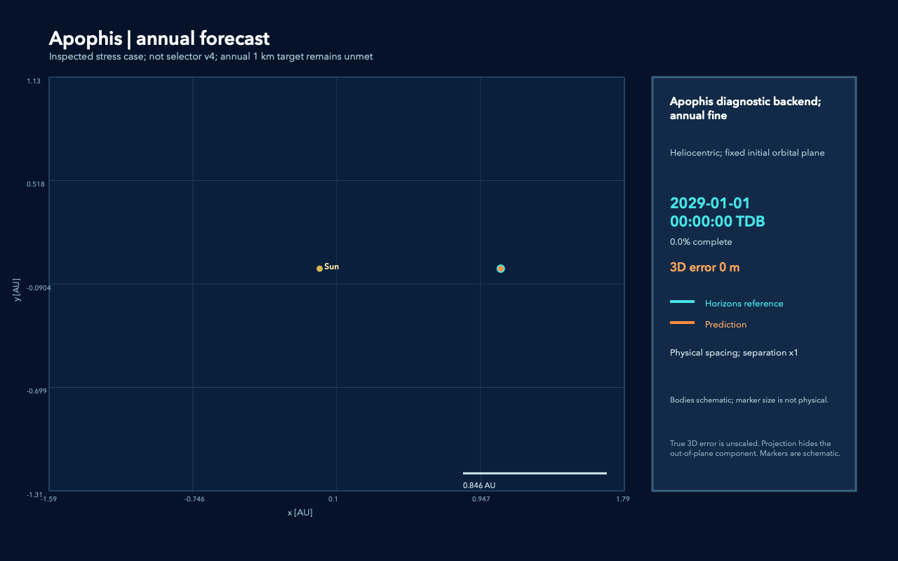
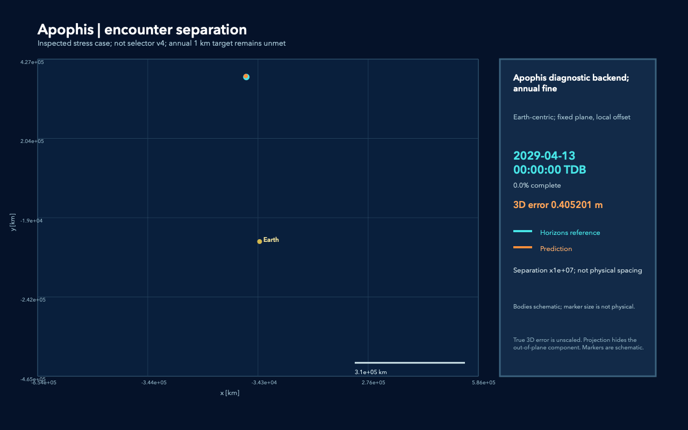

# Траектории: прогноз, эталон и место расхождения

Движущиеся маркеры постепенно рисуют две траектории: оранжевую прогнозную и
бирюзовую JPL Horizons. Дата у них одна и та же. Horizons здесь — вычисленная
номинальная эфемерида, а не непосредственно наблюдаемая «истинная орбита».
Все кадры используют исходные даты эталона; между ними эталон не достраивается.

## Как читать изображения

**Overview** показывает гелиоцентрическую траекторию в AU с настоящим
расстоянием между линиями. **Encounter** для Апофиса показывает земной пролёт
в километрах, также без изменения расстояний. **Zoom** выделяет окрестность
события или 90 суток вокруг максимума суточной ошибки для тела без заданного
события (с обрезкой по границам прогноза). Это выбор иллюстрации после оценки.
У zoom
разность может быть явно увеличена, чтобы метровые расхождения были видны
на фоне движения на сотни тысяч километров.
Для тел со сближением дополнительный **Divergence** показывает последние
90 суток прогноза: рост ошибки после события виден отдельно от самого
пролёта. Этот план гелиоцентрический, с фиксированным локальным сдвигом.

Увеличение применяется только к разности:

\[
p_{display}=r_{display}+G\,(p-r)_{projected}.
\]

Коэффициент `G` подписан как `Separation xG; not physical spacing`. Это
иллюстрация места и направления ошибки; увеличенная оранжевая линия не
является физической траекторией. Число `3D error` всегда равно настоящему
трёхмерному расстоянию между состояниями, до любых проекций и увеличений.
В подписи значения меньше 1 km выводятся в метрах; исходное поле
`error_km` в scene JSON всегда остаётся в километрах.
Оно относится к текущей дате кадра. Максимум в таблице результатов считается
по полной проверочной сетке, которая плотнее набора кадров GIF. Для сравнения
точности разных изображений используйте эти числа: коэффициент увеличения
разности у каждого крупного плана подбирается отдельно и всегда подписан.
Толщина линий и размеры маркеров условные. Бирюзовый ободок вокруг оранжевой
линии при совпадении — способ видеть обе линии, а не измеримая разность.
При огромном увеличении видны и малые численные/интерполяционные компоненты
остатка: например, зубчатый zoom у 2001 AV43 нельзя читать как настоящие
петли астероида или как доказательство колебательной физической силы.
Источник этой мелкой структуры отдельно не идентифицировался.

Плоскость проекции фиксируется по исходным положению и скорости: первая ось
вдоль начального радиуса, вторая лежит в начальной орбитальной плоскости,
третья — вдоль векторного произведения положения и скорости. Это проекция
ICRF-векторов в фиксированный базис, а не ICRF XY. Масштаб двух осей одинаков.
У крупного плана обе траектории используют одно начало координат: положение
планеты на ту же дату и фиксированный локальный сдвиг; для контрольного
объекта — гелиоцентрический локальный сдвиг. Проекция скрывает третью компоненту,
поэтому видимое двумерное расстояние может быть меньше `3D error`.

## Апофис: сохранённый сложный случай

Изображения используют `annual__fine` из
[аудита Апофиса](APOPHIS_ENCOUNTER_CLOSURE_REPORT.md): прогноз с 2029-01-01,
специальный подробный физический backend и независимый extrapolation solver.
Это изученный диагностический пример, не новое тело в confirmation100 и не
обычный fallback селектора v4. Годовое расхождение **2.552137 km** остаётся;
годовая задача с допуском 1 km не решена.

Для обзора используются точные сохранённые суточные узлы. Для крупного плана
2029-04-13 00:00 — 2029-04-14 12:00 TDB доступны 433 точных совпадения
исходных пятиминутных reference epochs и сохранённых prediction samples;
из них выбраны 120 кадров. Интерполяции прогноза в этих кадрах тоже нет.
Земля вычисляется тем же DE441 backend. К концу этого короткого интервала
настоящая ошибка — **8.872 m**; её дальнейший рост до 2.552 km отражён в
годовом обзоре. Увеличение разности на отдельном zoom — **10⁷**.
Поздний план использует 91 точный суточный узел с 2029-10-03 по
2030-01-01 TDB; настоящая ошибка растёт с **1.724 до 2.552 km**.
Здесь разность также увеличена в 10⁷ раз.

<!-- reviewed-media:start -->
Годовой обзор, настоящий масштаб:



[Пролёт Земли в настоящем пространственном масштабе](figures/trajectory_showcase/apophis__encounter.gif).
То же место с увеличением **только разности** в 10⁷ раз:



[Рост расхождения на последних 90 сутках](figures/trajectory_showcase/apophis__divergence.gif).

[Проверка координат](figures/trajectory_showcase/apophis__verification.json),
[provenance и преобразования](figures/trajectory_showcase/apophis__audit.json).
Кадры прошли проверку; компактные GIF, финальные PNG и scene JSON включены
в локальный каталог документации. Исходные raw data и полные traces остаются
исключёнными из Git. Иллюстрации новых тел приведены ниже;
вся confirmation100 и её аудит завершены.
<!-- reviewed-media:end -->

## Пять новых тел: результат и ограничения

Все эти тела входят в завершённую [confirmation100](SELECTOR_CONFIRMATION100_REPORT.md).
Примеры выбраны после оценки для объяснения результатов; они не заменяют
полную таблицу 100 тел. В колонке ошибки — максимум за весь указанный
горизонт по benchmark grid, а не только последний кадр.

| Тело и смысл примера | Выбранная модель, запрос | Максимум ошибки | Анимации |
| --- | --- | ---: | --- |
| 2001 AV43: новая встреча с Землёй, strong guard | physics_v4 → P+GR+SB16, 365 d / 1 km | 33.947 m | [Обзор](figures/trajectory_showcase/2001_AV43__overview.gif), [сближение](figures/trajectory_showcase/2001_AV43__zoom.gif), [позднее расхождение](figures/trajectory_showcase/2001_AV43__divergence.gif) |
| 229215 (2004 VN69): внешний пояс, v4 включает SB16 | physics_v4 → P+GR+SB16, 90 d / 1 km | 0.329 m | [Обзор](figures/trajectory_showcase/229215_v4__overview.gif), [деталь](figures/trajectory_showcase/229215_v4__zoom.gif) |
| То же тело и начальное состояние, ошибка старого выбора | tree_v3 → P, 90 d / 1 km | 1265.050 m | [Обзор](figures/trajectory_showcase/229215_v3__overview.gif), [деталь](figures/trajectory_showcase/229215_v3__zoom.gif) |
| 310442 (2000 CH59): Венера, неудачный fallback при 100 m | physics_v4 → P+GR+SB16, 365 d / 0.1 km | 100.969 m | [Обзор](figures/trajectory_showcase/310442_100m__overview.gif), [сближение](figures/trajectory_showcase/310442_100m__zoom.gif), [позднее расхождение](figures/trajectory_showcase/310442_100m__divergence.gif) |
| 893065 (2016 CL136): доступный NG, низкий перигелий | physics_v4 → P+GR+SB16, 365 d / 0.1 km | 153.166 m | [Обзор](figures/trajectory_showcase/893065_100m__overview.gif), [окрестность максимальной ошибки](figures/trajectory_showcase/893065_100m__zoom.gif) |
| 2012 SS109: Jupiter stratum, каталожный Centaur | physics_v4 → P+GR, 365 d / 1 km | 355.072 m | [Обзор](figures/trajectory_showcase/2012_SS109__overview.gif), [сближение](figures/trajectory_showcase/2012_SS109__zoom.gif), [позднее расхождение](figures/trajectory_showcase/2012_SS109__divergence.gif) |

Годовой прогноз 2001 AV43 в настоящем масштабе:


Крупный план того же прогноза на последних 90 сутках. **Только разность**
увеличена в 10⁹ раз; истинная конечная ошибка — 33.947 m:


У 229215 крупные планы имеют разные коэффициенты: **10⁷ для v3 и 10¹¹
для v4**. Пиксельное расстояние между линиями не сравнивает их точность;
сравнивайте 1265.050 m и 0.329 m. В overview обоих методов коэффициент 1.
У 310442/893065 zoom использует 10⁸, у 2012 SS109 — 10⁸ около события
и 10⁷ на позднем плане; у 2001 AV43 около события — 10⁸. На каждой
сцене значение явно подписано. Планета может лежать за пределами zoom;
тогда sidebar сообщает `outside view`, её маркер на границу не переносится.

Для CL136 крупный план содержит дни **189–279**, 2029-07-09—2029-10-07.
В середине, 2029-08-23, показан максимум **153.166 m**; на последнем
кадре ошибка уже меньше. Full не проходит 100 m, а лучший другой кандидат
P+GR даёт 130.130 m и тоже не проходит. Для CH59, напротив, P+GR даёт
85.642 m и проходит. [Почему эти два отказа различаются](SELECTOR_CONFIRMATION100_DIAGNOSTICS.md).

Эти 15 GIF вместе с четырьмя Apophis GIF составляют галерею **19 анимаций
шести уникальных тел**. Малые файлы подготовлены локально для документации;
публикация в GitHub не выполнялась.

## Воспроизводимость

[Сборщик сцен](../src/build_trajectory_showcase.py) читает проверенные
матрицы и traces. Для confirmation100 forecast восстанавливается тем же
native-endpoint Hermite interpolation, что и evaluator; каждая выбранная
ошибка сравнивается с сохранённым benchmark record с порогом 10⁻⁹ km.
Исходные target states в выборе модели не участвуют.

[Проверка координат](../src/verify_trajectory_showcase.py) независимо сверяет
source hashes, исходные reference nodes, сохранённый прогноз, даты, базис,
проекцию, усиление разности и настоящую 3D error.
[Нативный renderer](../src/render_trajectory_animation.swift) использует
уже доступные Swift/AppKit/ImageIO без установки пакетов.
[Проверка GIF](../src/verify_animation_media.swift) читает готовый файл:
число кадров, размеры, задержки, бесконечный цикл, SHA сцены, GIF и PNG.
Упаковка также проверяет совпадение исполняемого renderer с render metadata,
поэтому после его изменения требуется повторный рендер. Для визуальной проверки
сохраняются первый, средний и последний PNG.

```sh
PYTHONPATH=src uv run --no-project --python-preference only-system --python 3.14.7 python -B src/build_trajectory_showcase.py --source apophis --object 99942 --output outputs/trajectory_showcase/apophis
PYTHONPATH=src uv run --no-project --python-preference only-system --python 3.14.7 python -B src/verify_trajectory_showcase.py outputs/trajectory_showcase/apophis
mkdir -p /private/tmp/swift-module-cache
swiftc -module-cache-path /private/tmp/swift-module-cache src/render_trajectory_animation.swift -o /private/tmp/render_trajectory_animation
swiftc -module-cache-path /private/tmp/swift-module-cache src/verify_animation_media.swift -o /private/tmp/verify_animation_media
/private/tmp/render_trajectory_animation outputs/trajectory_showcase/apophis/overview.json outputs/trajectory_showcase/apophis/overview
/private/tmp/verify_animation_media outputs/trajectory_showcase/apophis/overview
```

Для воспроизведения всей галереи после компиляции двух Swift tools:

```sh
PYTHONPATH=src uv run --no-project --python-preference only-system --python 3.14.7 python -B src/run_trajectory_showcase.py
```

Команда собирает сцены по конфигурации, проверяет координаты, рендерит все
19 GIF и проверяет их структуру/hashes. После неё остаётся визуальная
проверка: она не подменяется успешным exit code. Финальные компоновки
всех сцен и выбранные начальные/средние кадры просмотрены; проверены
рост trails, читаемость, общий масштаб осей, даты, метры/километры и gain.
Негативные проверки отклоняют изменённую сцену и изменённый GIF по SHA.

После визуальной проверки первый/средний/последний кадры и текущие audits
передаются `src/package_trajectory_showcase.py`: аргументы — все каталоги
объектов из `outputs/trajectory_showcase`. Он собирает небольшие GIF, PNG,
scene JSON и manifest SHA в `docs/figures/trajectory_showcase`; это
подготовка локальной документации, без публикации в GitHub.

```sh
PYTHONPATH=src uv run --no-project --python-preference only-system --python 3.14.7 python -B src/package_trajectory_showcase.py outputs/trajectory_showcase/apophis outputs/trajectory_showcase/2001_AV43 outputs/trajectory_showcase/229215_v4 outputs/trajectory_showcase/229215_v3 outputs/trajectory_showcase/310442_100m outputs/trajectory_showcase/893065_100m outputs/trajectory_showcase/2012_SS109
```

Состав и SHA всех подготовленных файлов:
[manifest](figures/trajectory_showcase/manifest.json). В каждом комплекте
есть координатный audit/verification, GIF, финальный PNG, scene JSON и
render metadata с SHA сцены, GIF, контрольных PNG и renderer binary.
Промежуточные PNG и исходные traces сохраняются только в ignored outputs.

GIF содержит до 120 кадров 1280×800 с задержкой 0.06 s на кадр. Подписи дают
точную дату; равная длительность кадров не обещает совершенно равномерную
скорость модельного времени после прореживания исходной сетки.
Выбор примеров для иллюстраций сделан после оценки; он не создаёт нового
validation score. Объекты, методы, горизонты, допуски и цель каждого
примера перечислены в [конфигурации галереи](../configs/trajectory_showcase.json).
Полная физическая диагностика, включая Earth J2/NG и
форму Апофиса, остаётся в [истории поиска ошибки](PHYSICS_DIAGNOSTICS.md).
