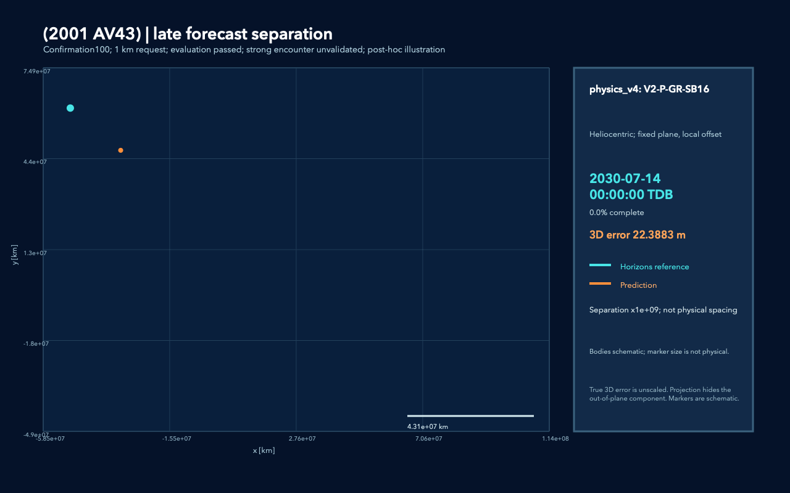
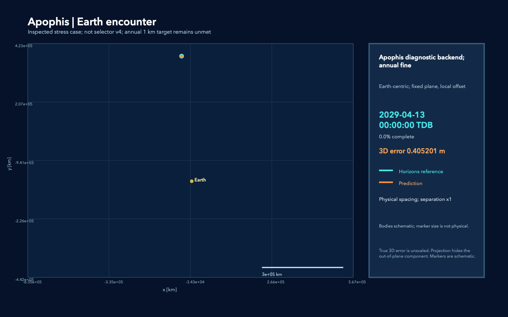
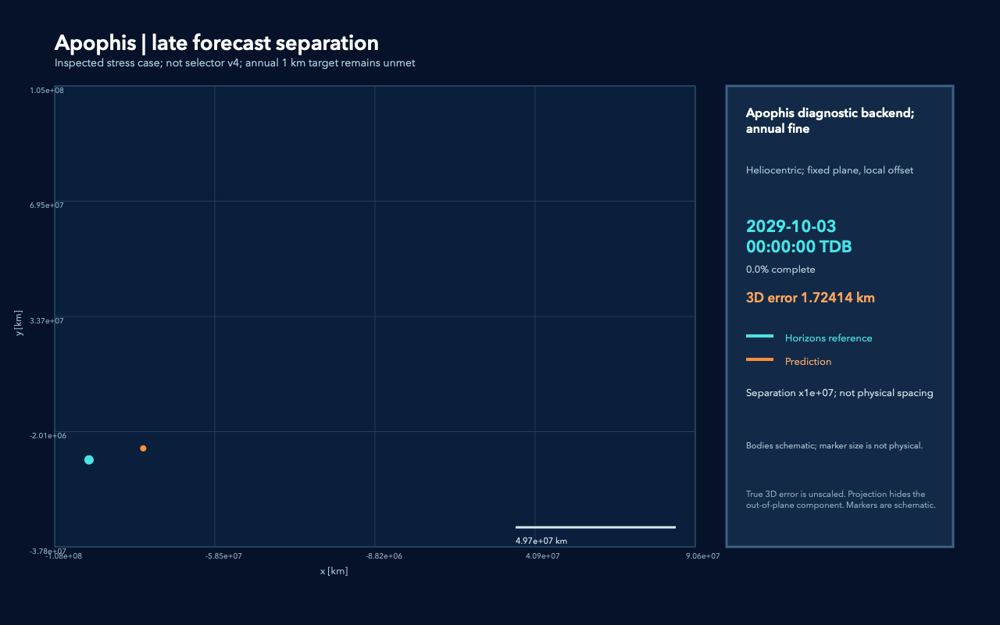
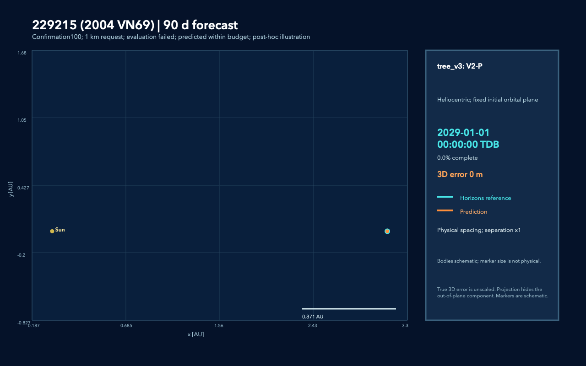
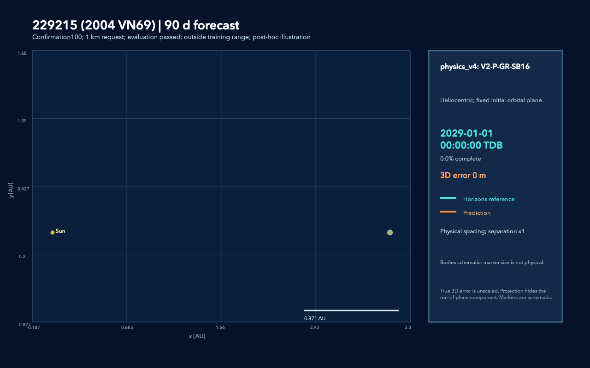
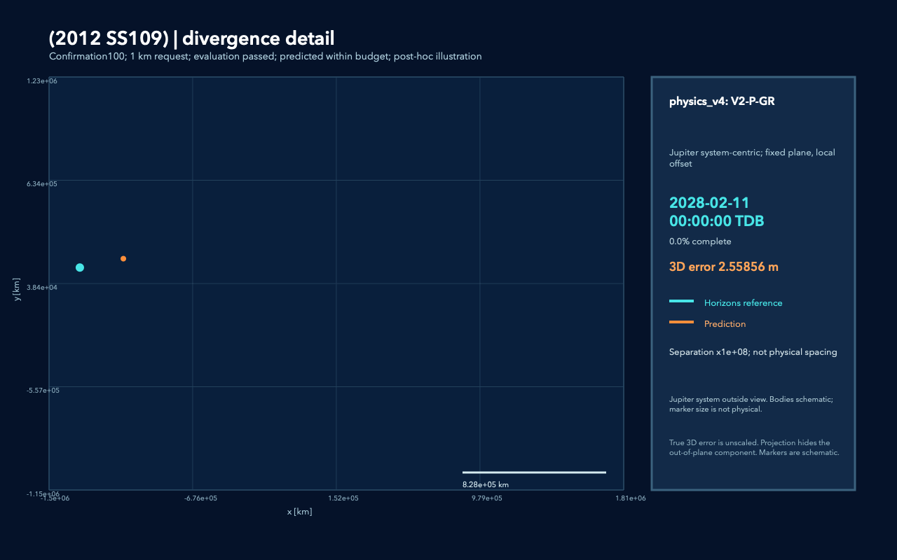
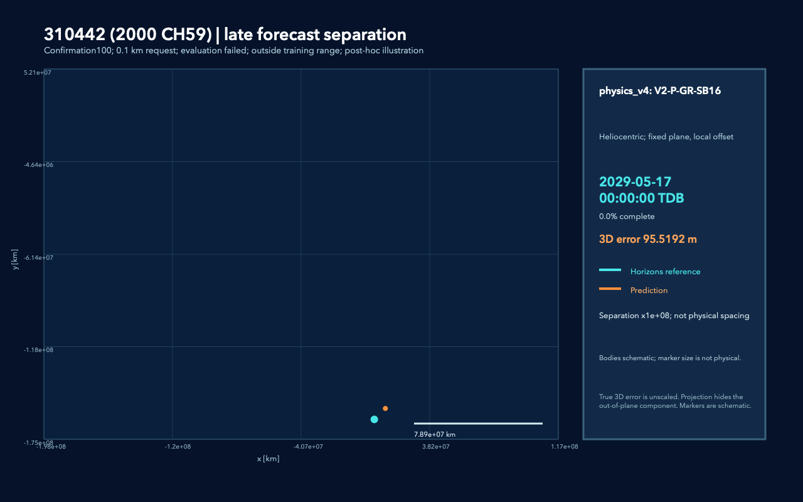

# Траектории, которые рисуют себя

Две линии растут из одного начального состояния: **оранжевая — прогноз,
бирюзовая — JPL Horizons**. Маркеры всегда показывают одну дату.
Horizons — вычисленная номинальная эфемерида, с которой сравнивается модель.

[Главная](../README.md) · [Истории ошибок](PHYSICS_STORIES.md) · [Результаты 100 тел](SELECTOR_CONFIRMATION100_REPORT.md)

## 2001 AV43: год вперёд

Новый случай встречи с Землёй. Физическое правило выбирает полный кандидат;
максимум ошибки на годовом горизонте — **33,947 м** при запросе 1 км.

В обзоре масштаб настоящий: разность в десятки метров практически не видна
на фоне сотен миллионов километров движения. На последних 90 сутках можно
увидеть её направление, увеличив **только разность в 10⁹ раз**:

[Крупный план сближения, разность ×10⁸](figures/trajectory_showcase/2001_AV43__zoom.gif).
Мелкие изгибы увеличенной линии не являются реальными петлями астероида;
источник мелкой структуры остатка отдельно не установлен.

## Апофис: сильная встреча

Изученный сложный случай со специальным diagnostic backend. **Не входит
в 100 новых тел и не является обычным v4 fallback.** Годовой допуск 1 км
остаётся невыполненным: максимум расхождения **2,552 км**.

Это система отсчёта около Земли; расстояния между траекториями не увеличены.
К концу показанного короткого окна ошибка — около 8,872 м. Основное расхождение
накапливается позже, что видно на отдельном плане последних 90 суток:

На позднем плане **разность ×10⁷**, настоящая ошибка растёт примерно
с 1,724 до 2,552 км.

[Годовой обзор, настоящий масштаб](figures/trajectory_showcase/apophis__overview.gif) ·
[Пролёт с увеличением только разности ×10⁷](figures/trajectory_showcase/apophis__zoom.gif) ·
[Что проверялось](APOPHIS_ENCOUNTER_CLOSURE_REPORT.md).

## 229215: цена выбора модели

Одинаковые исходное состояние и 90 суток. Старый v3 выбирает планетную модель
и получает максимум **1 265,050 м**. V4 включает более полный набор сил
с SB16 и получает **0,329 м**.

| Старый выбор v3 | Физическое правило v4 |
| :---: | :---: |
|  |  |

Разность слишком мала для такого обзора. Откройте детали:
[v3, разность ×10⁷](figures/trajectory_showcase/229215_v3__zoom.gif) и
[v4, разность ×10¹¹](figures/trajectory_showcase/229215_v4__zoom.gif).
**Сравнивайте ошибки в метрах, не расстояния в пикселях:** gains различаются.

Добавление SB16 доминирует в этой абляции; индивидуальный астероид-возмутитель
не установлен. У v3 и v4 различается также обучение, поэтому это сравнение
готовых методов, а не изолированная проверка архитектуры ML.

## 2012 SS109: другой динамический режим

Каталожный Centaur из группы встреч с Юпитером. Выбран P+GR;
максимальная годовая ошибка — **355,072 м** при запросе 1 км.

На этом крупном плане **разность ×10⁸**; Юпитер может находиться за рамкой,
что явно подписано. [Годовая траектория, настоящий масштаб](figures/trajectory_showcase/2012_SS109__overview.gif) ·
[Последние 90 суток, разность ×10⁷](figures/trajectory_showcase/2012_SS109__divergence.gif).

## 310442: достаточная модель есть, но fallback промахнулся

При запросе 100 м полный кандидат дал **100,969 м**, хотя P+GR укладывается
в допуск с **85,642 м**. Это ошибка выбора, не отсутствие решения среди кандидатов.

**Разность ×10⁸.** [Годовой обзор](figures/trajectory_showcase/310442_100m__overview.gif) ·
[Крупный план около Венеры, разность ×10⁸](figures/trajectory_showcase/310442_100m__zoom.gif).

## 2016 CL136: текущего набора недостаточно

У 893065 / 2016 CL136 при запросе 100 м лучший кандидат даёт **130,130 м**,
полный — **153,166 м**. Ни один кандидат не проходит строгий допуск.

**Разность ×10⁸.** Показаны дни 189–279; максимум ошибки находится в середине,
2029-08-23. Это иллюстративное окно выбрано после оценки и не используется
как признак. [Годовой обзор](figures/trajectory_showcase/893065_100m__overview.gif) ·
[Разбор обоих 100-метровых отказов](SELECTOR_CONFIRMATION100_DIAGNOSTICS.md).

## Как читать масштаб и цифры

- **Overview**: настоящий масштаб в AU, фиксированная орбитальная проекция.
- **Encounter**: пролёт Апофиса относительно Земли, настоящий масштаб в км.
- **Zoom / divergence**: разность может быть увеличена; коэффициент подписан
  `Separation xG; not physical spacing`. Такая линия иллюстрирует остаток.
- **3D error**: настоящее трёхмерное расстояние, всегда без увеличения.
- **Максимум ошибки в тексте**: по полной проверочной сетке; она плотнее кадров GIF.

Размеры маркеров условные. Проекция скрывает третью компоненту, поэтому
видимый промежуток не заменяет 3D error. Пять новых тел выбраны для рассказа
после завершения оценки; полная статистика включает все 100 тел.

**19 GIF · 7 вариантов · 6 уникальных тел.**
[Методика, координаты и сборка](TRAJECTORY_RENDERING.md) ·
[Manifest SHA-256](figures/trajectory_showcase/manifest.json) ·
[Конфигурация](../configs/trajectory_showcase.json).
